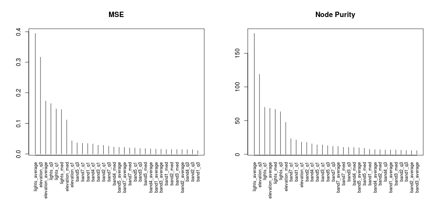
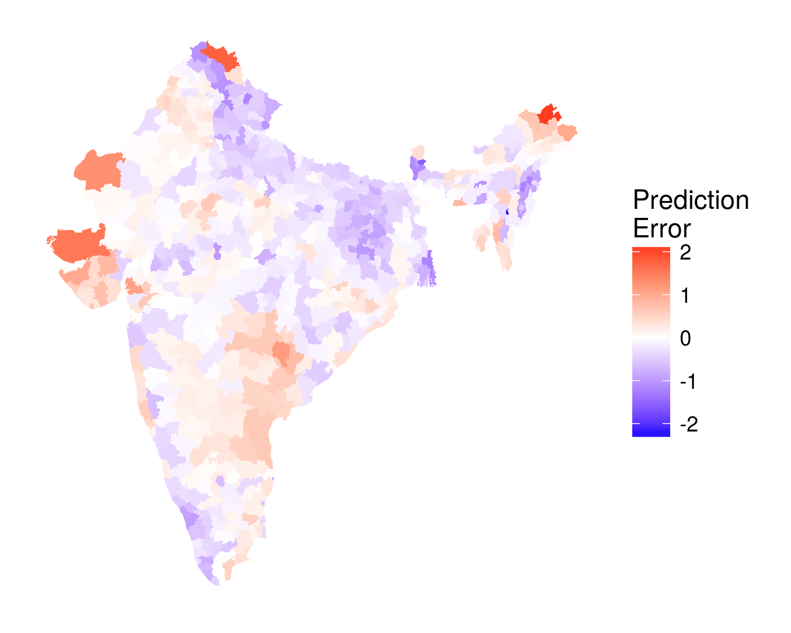
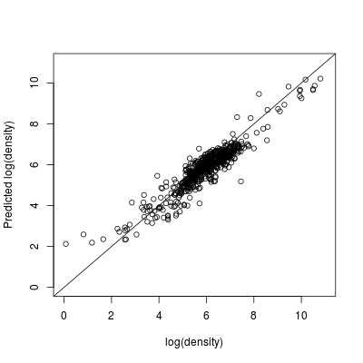
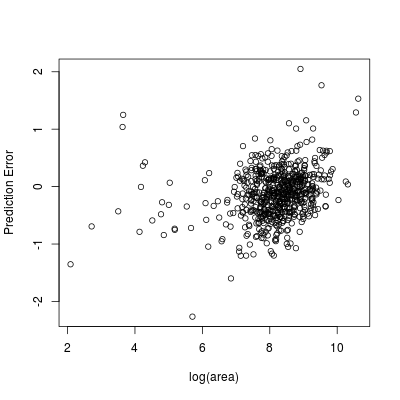

[//]: render("summary.html") from rmarkdown package

---

## Methods

Estimating inequality requires a measure of economic activity at an individual level. Most of the literature currently relies on survey or census data, which are often by financial and political causes---particularly in the developing world. In this paper I propose a methodology to measure per-capita economic activity---and therefore income inequality---using satellite date. The only "on the ground" data that this methodology requires are simple census population counts, which are available for most countries.

Following a recent literature, I measure economic activity by the intensity of night-time lights, as measured by the Defense Meteorological Satellite Program. These data have been shown to accurately capture growth rates at national and regional levels. However, a prominent shortcoming of these data is the inability to separately identify the effect of population from economic activity. Sparse areas with high levels of per-capita economic activity may resemble dense areas with low activity. 

To account for population changes I utilize additional satellite sources, the most significant of which are the Landsat satellites. These satellites record surface reflectance across six spectral bands (three visible and three infrared). These data are combined with the night-lights data and elevation obtained from the Shuttle Radar Topography Mission to obtain population estimates at a five square kilometer resolution. The ratio of night-lights to population therefore gives a measure of average economic activity per person at the five kilometer resolution.

The estimation method is applied to India, where a decennial census counts population for each of the 614 districts (I exclude the island states and the politically disputed Kashmir region). Satellite data is extracted for each district and utilized to obtain estimates of the (log) population densities.

The relationship between district population density and the satellite information is given by the equation

$$ log(density_{d,t}) = f(Sat_{d,t}) + \varepsilon_{d,t} $$

where $Sat_{d,t}$ is a matrix of satellite data associated with district $d$ in time $t$ and $\varepsilon_{d,t}$ is a mean zero disturbance term.

There is no theory that informs the structure of $f(\cdot)$. The relationship between population density, night lights, reflectance, and elevation is likely to be highly non-linear. I estimate $f(\cdot)$ using a random forest algorithm, which assumes high-level interactions between explanatory variables. I then create a five-kilometer grid that covers the country, and the satellite data associated with each pixel is used to predict the population density in that segment. Per capita lights, the main measure of economic activity, are then estimated as

$$ PerCapitaLights_{i,t} = \dfrac{lights_{i,t}}{exp(\hat{f}(Sat_{i,t}))} $$

were $i$ indexes the five-kilometer pixel in question. 

## Preliminary Results

The mean, median, and first and third quartiles of each satellite band are calculated for each district, which results in 32 variables (elevation, night lights, and 6 reflectance bands). The random forest algorithm is highly efficient---log population density is predicted at the district level with a mean-squared error of 0.18. Though the high-level interactions and discontinuities in the predicted $\hat{f}(\cdot)$ preclude the ability to calculate marginal effects, two methods are available to ascertain the relative importance of each variable.

As expected, night lights are the most influential variables. For the reflectance bands, first and third quartiles appear to be more important than medians and means, which suggests that the distribution of reflectance within the districts is more important than simple averages.

The same summary statistics are collected at a five kilometer level, and population density is estimated for each pixel. The accuracy of the resulting estimation can then be checked by aggregating up to the district level, and comparing the predicted population density to the known population density from the census data. The regression of the known densities against the predicted densities results in an $R^2$ of 0.867, meaning that nearly 87% of the variation in district level population density can be explained by variation in the density at the 5 kilometer level.

The prediction error is largely random across space. The largest errors occur in border regions, such as the militarized north-west border with Pakistan and the mountainous borders in the north east. However, these districts tend to be sparsely populated, so the relatively large prediction error (in log terms) accounts for a very small percentage of the population.

The geographical area is not highly correlated with the prediction error. The methodology does not appear to systematically change as the size of the region increases. This property is important, as inequality measures will eventually be calculated over large regions, so unbiased estimates of population will result in unbiased inequality measures. 

The estimated measure of per capita economic activity fits a broad set of stylized geographical facts. Poverty levels are believed to be higher in the north-eastern portion of the country, in the Ganga basin. In contrast, the north-west and south-west areas are considered wealthier. These facts are reflected in the map below.

<iframe width=100% height=500 src="map5k.html"></iframe>
